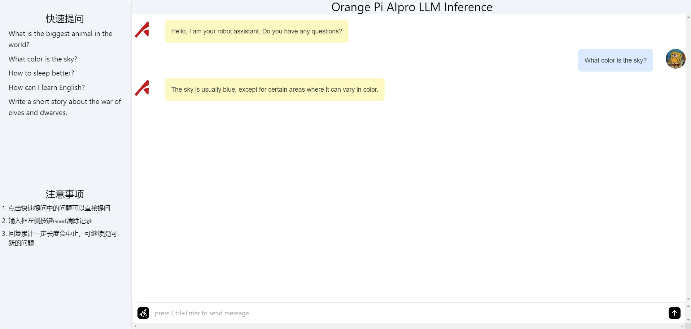

# Tiny_Llama ManualReset 

## 简介

本项目基于香橙派部署Tiny-Llama大语言模型。

本项目基于[ascend-llm](https://gitee.com/yinghuo302/ascend-llm)实现,原项目由南京大学计算机科学与技术系杜骋同学主导,由朱光辉老师进行指导,昇腾CANN团队提供技术支持。

## 关键技术
- 静态图方案

    在Transformer模型中,基于模型的自回归推理特性,业界普遍采用kvcache缓存的方式增加模型的推理性能.kvcache会缓存上一次推理得到的kv矩阵用于本次推理,大大减少了推理计算量.
    
    由于缓存的kv矩阵要和当前输入字符计算出的kv矩阵进行拼接,因此每次推理完整的kv矩阵长度一直在增加,致使模型shape不固定,会走动态推理流程,存在大量算子编译时间,推理性能大大下降.
    
    本方案基于原先动态图方案,将kv矩阵固定到一个最大长度,结合attention_mask屏蔽输入序列部分位置的特性实现了静态图的方案.在kvcache达到上限时通过主动清理kvcache的方式让模型可以反复推理.

- 量化方案

    大模型权重过大,在端侧设备由于内存限制通常难以运行,因此通常将大模型权重从fp16量化到int8甚至int4降低内存消耗.

    本项目采用SmoothQuant量化方案,通过对权重和激活值均采用int8量化，显著节省了内存并提升了推理速度.

## 快速启动
### 启动步骤
1. 下载[香橙派0318镜像](https://www.hiascend.com/forum/thread-0231149828762292018-1-1.html)，烧录到sd卡，启动环境，参考[香橙派AIpro快速上手指南](https://www.hiascend.com/forum/thread-0260140249549075069-1-1.html)。 
2. 使用root用户登录环境，clone当前仓到空闲目录  
    ```
    git clone https://gitee.com/wan-zutao/tiny-llama-manual-reset.git tiny_llama
    cd tiny_llama/inference
    ```
3. 运行download.sh，下载model,tokenizer文件。  
    ```
    bash download.sh
    ```
4. 启动程序  
    ```
    python3 main.py
    ```
5.  根据打屏信息，在浏览器输入地址，即可开启对话  
    浏览器的输入命令行打印的url地址
    
    

## 详细步骤
### 环境准备
1. 环境准备
   
    烧录香橙派最新镜像即可，如需升级CANN包，可参考[CANN包更新](https://www.hiascend.com/forum/thread-0260140249549075069-1-1.html)

3. 下载代码到环境
    ```
    git clone https://gitee.com/wan-zutao/tiny-llama-manual-reset.git tiny_llama
    ```

4. 自定义算子部署
    - protoc安装
    ```
    # 安装protoc==1.13.0, 找一空闲目录下载
    wget  https://obs-9be7.obs.cn-east-2.myhuaweicloud.com/wanzutao/tiny-llama/protobuf-all-3.13.0.tar.gz --no-check-certificate
    tar -zxvf protobuf-all-3.13.0.tar.gz
    cd protobuf-3.13.0
    apt-get update
    apt-get install autoconf automake libtool
    ./autogen.sh 
    ./configure
    make -j4
    make install
    sudo ldconfig
    protoc --version # 查看版本号
    ```

    - 算子编译部署
    ```
    # 将./custom_op/matmul_integer_plugin.cc 拷贝到指定路径
    cd tiny_llama
    export ASCEND_PATH=/usr/local/Ascend/ascend-toolkit/latest
    cp custom_op/matmul_integer_plugin.cc $ASCEND_PATH/tools/msopgen/template/custom_operator_sample/DSL/Onnx/framework/onnx_plugin/
    cd $ASCEND_PATH/tools/msopgen/template/custom_operator_sample/DSL/Onnx 
    ```
    打开build.sh，找到下面四个环境变量，解开注释并修改如下：
    ```
    export ASCEND_TENSOR_COMPILER_INCLUDE=/usr/local/Ascend/ascend-toolkit/latest/include
    export TOOLCHAIN_DIR=/usr
    export AICPU_KERNEL_TARGET=cust_aicpu_kernels
    export AICPU_SOC_VERSION=Ascend310B4
    ```
    编译运行
    ```
    ./build.sh 
    cd build_out/
    ./custom_opp_ubuntu_aarch64.run
    # 生成文件到customize到默认目录 $ASCEND_PATH/opp/vendors/，删除冗余文件
    cd $ASCEND_PATH/opp/vendors/customize
    rm -rf op_impl/ op_proto/
    ```

5. 依赖安装
   进入项目根目录
   
    ```
    cd tiny_llama/inference
    pip install -r requirements.txt -i https://mirrors.huaweicloud.com/repository/pypi/simple
    ```

### 推理运行
1.  下载tokenizer文件
    ```
    cd tokenizer
    wget https://obs-9be7.obs.cn-east-2.myhuaweicloud.com/wanzutao/tiny-llama/tokenizer.zip
    unzip tokenizer.zip   
    ```
2.  获取onnx模型文件
    ```
    cd ../model
    wget https://obs-9be7.obs.cn-east-2.myhuaweicloud.com/wanzutao/tiny-llama/tiny-llama.onnx
    ```
3.  atc模型转换
    ```
    atc --framework=5 --model="./tiny-llama.onnx"  --output="tiny-llama" --input_format=ND --input_shape="input_ids:1,1;attention_mask:1,1025;position_ids:1,1;past_key_values:22,2,1,4,1024,64" --soc_version=Ascend310B4 --precision_mode=must_keep_origin_dtype
    ```
4.  脚本启动
    ```
    cd ..
    python3 main.py
    ```
